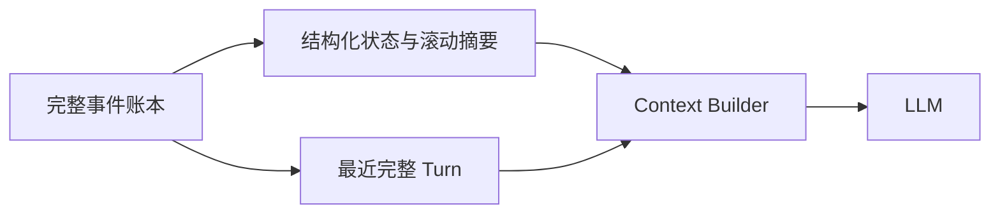
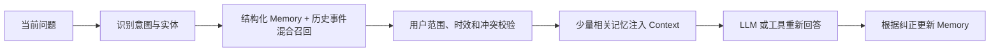
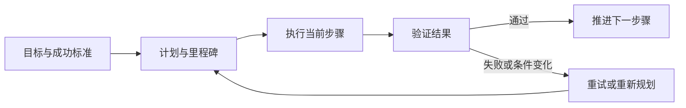
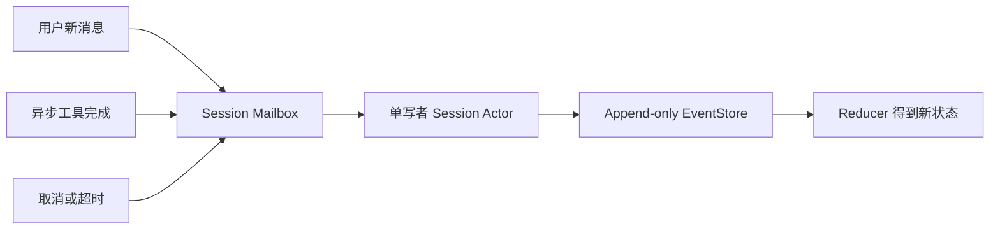
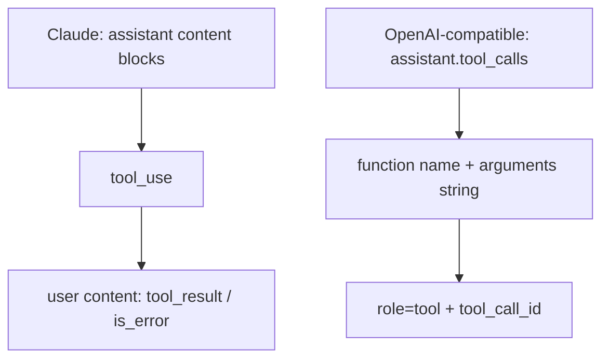

# Agent 架构设计题

以下五个模块各选择一道题作答。答案以工程取舍为主，并结合 GlassBox Agent 的实际实现说明边界。

## 模块一：Context / Performance

**题目：一个 session 连续聊了 200 轮，context 快爆了。你会怎么做压缩？如何确保压缩后的对话仍然流畅？**

我的核心判断是：**压缩的对象应该是模型本轮看到的 Context，而不是永久删除历史**。如果简单地把前 196 轮总结成一段文字，目标调整、约束变更、用户纠正和工具结果很容易被混在一起；摘要越长，信息优先级越不清楚，也越容易产生语义漂移。

因此我会把完整历史和活动 Context 分开：完整对话、工具调用和结果继续保存在事件账本中；每次真正发给模型的内容，则由结构化状态、旧轮次摘要、最近几轮原文和当前未完成任务组成。

具体策略如下：

1. **保留当前状态，而不只是故事梗概。**目标、最新约束、已确认事实、工具结论和未完成事项以结构化 Memory 保存。用户把预算从一万元改成两万元时，当前状态应更新为两万元，并保留修改来源，不能让新旧值无差别地并存。
2. **旧轮次增量压缩，最近轮次保留原文。**每次只用“上一版 Memory + 新淘汰的完整 turn”生成下一版 Memory，避免反复总结全部历史；最近 4～10 轮保留原文，用来维持指代、语气和局部连贯性。
3. **以完整 turn 为压缩边界。**Agent 的 `tool_call`、`tool_result` 和最终结论是一个整体，不能从中间截断；正在执行工具或等待确认的 turn 不参与压缩。
4. **提前触发而不是等到溢出。**达到窗口约 70%～80% 时，在一轮结束后或空闲时压缩；预算还要为系统指令、工具 Schema、工具结果和模型输出预留空间。

压缩失败时，不修改原始历史，而是继续使用上一版有效 Memory，加上最近完整轮次和 reducer 重建出的 todo 状态。若用户询问久远细节，可从原始事件中按需召回，而不是完全相信多次迭代后的摘要。

“流畅”也需要可验证：应测试最新目标和约束是否保留、工具调用与结果是否配对、久远事实能否找回、摘要失败后能否继续，以及压缩前后的 token、延迟和回答质量。GlassBox 已实现事件账本、完整 turn 压缩、结构化 Memory、最近窗口和失败降级；生产化时还应改用真实 token 预算，并增加历史检索和事实来源校验。

## 模块二：Memory

**题目：和聊天 Agent 熟悉半个月后，用户问了一个以前问过的问题。Agent 如何做 memory 召回更合理？**

我的核心判断是：**Memory 的价值是恢复历史语境，而不是缓存并复读旧答案**。半个月前的回答可能仍然有效，也可能因为用户偏好、任务条件或外部事实变化而失效，所以“检索到以前问过”只是召回的开始，不是回答的结束。

我会把 Memory 分成两层：少量稳定且高价值的信息，例如用户偏好、长期目标和已确认约束，作为结构化长期记忆；具体某次讨论、方案选择和问题解决过程，作为带时间与来源的历史事件保存，需要时再检索。

召回不应只依赖向量相似度。向量检索适合找语义相近的历史，但对数字、专有名词和否定关系不够稳定；因此要结合关键词、时间、Memory 类型和用户 ID 做混合召回，再按相关性、重要性、置信度和时效性排序，只注入少量高质量结果。

- 用户稳定偏好或历史决策可以复用，但应保留当时原因和来源。
- 价格、政策、产品版本等时效性事实必须重新调用工具验证，旧 Memory 只作为背景。
- 用户后来纠正过旧信息时，优先使用最新明确版本；无法判断冲突时应向用户确认。
- 没有可靠召回结果就按新问题回答，不能为了表现“记得用户”而编造记忆。

Memory 写入同样需要克制：只长期保存用户明确要求记住的内容、稳定偏好、重要决策、用户纠正和未完成的长期事项，并提供用户隔离、过期、修改和删除机制。

GlassBox 当前的 Memory Capsule 只服务于单个 Session 的 Context 压缩，还不是真正的跨 Session 长期记忆。继续扩展时，我会在事件账本之上增加独立的用户级 Memory Store 和 Retriever，但仍把原始事件作为可审计的事实来源。

## 模块三：Task

**题目：对于长程任务，大模型执行一段时间可能会忘掉目标。你知道哪些解决方案，有什么优缺点？**

我的核心判断是：**长程任务不能依赖模型在对话里“记住目标”，目标必须成为 Runtime 管理的外部状态**。随着工具结果和中间讨论增加，原始目标会被稀释；仅在 Prompt 中反复提醒，仍可能出现目标漂移，或“完成了很多步骤但没有完成任务”。

我会把任务拆成三层：较稳定的任务契约，包括最终目标、约束、成功标准和权限边界；可修改的计划或里程碑；当前步骤、工具结果、产物和未解决问题。每次调用模型时，重新注入与当前步骤相关的状态，而不是重放全部过程。

每个步骤都应产生可观察结果，并由 verifier 判断它是否真的推动了目标，不能只相信模型声称“已完成”。重新规划可以修改执行路径，但不能静默改变最终目标和权限边界；涉及范围扩大、外部副作用或成功标准变化时，应暂停并请求用户确认。

常见方案各有边界：完整历史最简单但成本和噪声不断增加；滚动摘要节省 Context 但可能让目标漂移；固定工作流可靠但不够灵活；纯 Planner–Executor 灵活却可能频繁重规划。我的选择是混合方案：用结构化 Task State 和状态机守住目标、约束与完成条件，用 LLM 负责计划和局部决策。

GlassBox 已具备事件账本、reducer、todo 和最大 step，可重建执行过程；如果扩展为长程任务，还需加入正式的 Task、Milestone、Plan Revision 和 Verifier，不能把 todo 列表直接当成完整任务系统。

## 模块四：Tool / Session Runtime

**题目：如果 session state 为 busy，此时用户又发来新消息，或者异步工具完成事件也到达，runtime 应如何处理？**

我的核心判断是：**同一个 Session 可以同时接收多个事件，但不应该由多个执行流同时修改状态**。否则用户消息、模型输出和异步工具结果会产生竞态，最终顺序既难解释，也难 replay。

我会把每个 Session 设计成单写者 Actor。用户消息、工具完成、取消命令和超时先变成带序号的事件进入 mailbox，再由该 Session 的 Runtime 串行消费。数据库事件账本是事实来源，内存中的 `busy` 只是投影，不能作为唯一依据。

Session 正在运行时，普通用户消息默认排到下一个 turn，避免突然改变当前工具链的语义；取消、暂停、补充约束等控制消息可以标记为高优先级，但只在安全点生效。如果需要支持“边执行边纠正”，应设计为显式 steering 事件，而不是让任意消息直接插入当前模型上下文。

异步工具结果必须携带 `session_id`、`run_id`、`tool_call_id` 和 `attempt`。只有当它仍对应当前 pending call 时才恢复执行；任务已取消或重新规划时，迟到结果仍进入账本用于审计，但标记为 stale，不再驱动模型。重复回调使用幂等键去重，外部副作用工具也必须使用幂等键，避免超时重试造成重复执行。

并发正确性的重点不是“谁先到”，而是建立可解释的顺序和状态转换。生产实现还应使用状态版本或事务比较更新处理多 worker 抢占，并通过 outbox 将通知和状态提交一起落库，避免任务已完成但通知丢失。

GlassBox v1 通过事件序号、reducer 和未完成工具调用恢复提供了基础，但仍是同步、单进程实现；生产化需要 mailbox、租约或版本控制、异步 worker、幂等回调和通知 outbox。

## 模块五：Agent Runtime 架构对比

**题目：Claude Code 的工具输出方式和国内 GLM / 豆包等 OpenAI-compatible function calling 有什么不同？各自设计的优缺点是什么？**

这个问题应分成两层：Claude Code 是完整 Agent 产品和 Runtime，而 function calling 是模型 API 协议。真正可比较的是 Runtime 与模型之间如何表达一次工具调用和结果。

Claude/Anthropic 使用内容块协议：模型在 assistant 消息的 `content` 中产生带 ID 的 `tool_use` block；Runtime 执行后，在下一条 user 消息中返回对应的 `tool_result` block。结果可以包含文本、图片或文档，并可用 `is_error` 明确表示执行失败。文本和工具事件可以按顺序出现在同一组 content blocks 中，因此整个 turn 更像有类型的事件流。

OpenAI-compatible Chat Completions 通常把调用放在 assistant 消息独立的 `tool_calls` 字段中，参数一般是 JSON 字符串；Runtime 执行后追加一条 `role=tool`、携带 `tool_call_id` 的消息。它更像传统 RPC/function interface，结构简单，也有成熟的 SDK 和更广的模型生态。

Claude 方案表达能力强：文本、多模态结果、错误和多个工具事件可以保留原始顺序，适合需要展示完整执行轨迹的 Agent；代价是消息配对和 block 顺序要求严格，接入方需要理解 Anthropic 特有结构。

OpenAI-compatible 方案接口直观、生态成熟、切换模型的接入成本较低；但“兼容”通常只表示字段形状接近，不代表行为完全一致。不同厂商在 JSON Schema、strict mode、并行调用、流式增量、错误表达和 reasoning 字段上仍可能不同。工具参数始终应由 Runtime 自己解析和校验，工具错误也最好统一成业务错误结构。

因此 Agent Core 不应直接依赖任一种外部消息格式，而应通过 Provider Adapter 统一转换成内部的 `ToolCall`、`ToolResult` 和 Runtime Event，并始终保留原始 call ID。Provider 负责协议翻译，Runtime 负责执行、幂等、错误恢复和日志。GlassBox 已采用这种思路：DeepSeek/OpenAI-compatible 响应先解析成内部 `ModelDecision`，后续 loop 和工具注册机制不再关心外部字段；未来支持 Claude 只需新增适配器，无需重写 Runtime。

参考：[Anthropic Tool Use](https://platform.claude.com/docs/en/agents-and-tools/tool-use/how-tool-use-works)、[Anthropic Tool Result](https://platform.claude.com/docs/en/agents-and-tools/tool-use/handle-tool-calls)、[DeepSeek Tool Calls](https://api-docs.deepseek.com/guides/tool_calls)。
