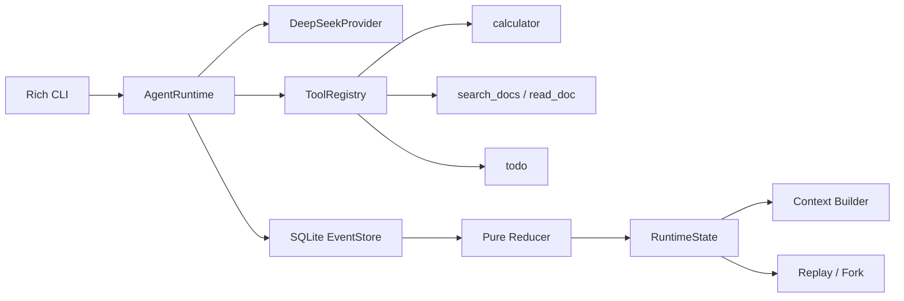
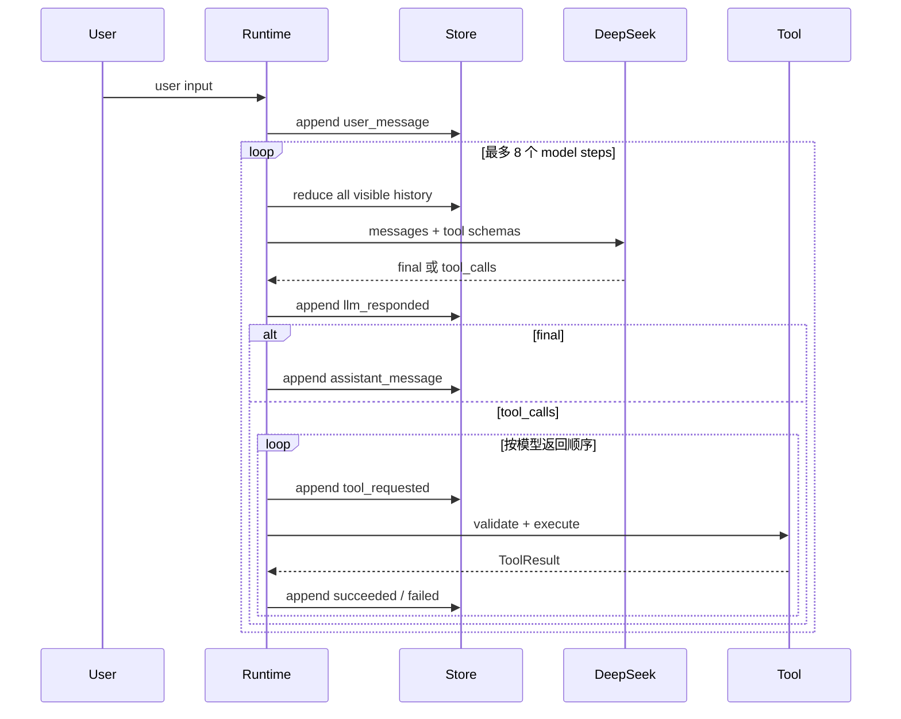

# GlassBox Agent

一个从零实现、透明、可回放的最小 Agent Runtime。它真实调用 DeepSeek Chat
Completions，自主决定直接回答或调用工具；不依赖 LangGraph、OpenHands、OpenClaw 等
Agent 框架。

GlassBox 的差异化不是“多一个聊天壳”，而是一台 **Agent 飞行记录仪**：每个用户输入、
模型决策、工具调用、错误和压缩结果都进入 append-only SQLite 事件账本，运行状态只能由纯
reducer 重建。因此同一套事实同时服务于正常运行、恢复、离线 replay、context 构建与 fork。

## 提交材料

- [架构设计题答案](ARCHITECTURE_DESIGN.md)：Context、Memory、Task、Tool/Session Runtime、Runtime 协议对比五个模块。
- [AI 辅助开发记录](AI_ASSISTED_DEVELOPMENT.md)：提示词、采纳/拒绝理由、真实问题与修复。
- [演示流程稿](RECORDING_SCRIPT.md)：录屏中的完整操作路径与预期结果。
- [演示视频与校验信息](DEMO_VIDEO.md)：视频作为 `v0.1.0` GitHub Release 附件发布。
- [示例 JSONL Trace](examples/trace.example.jsonl)：可公开审计的事件流示例。

本地验收结果：`Doctor passed`、真实 DeepSeek eval `3/3 passed`、`39 tests passed`、分支覆盖率 `96.27%`。

> 安全边界：项目不会显示或持久化原始思维链。公开账本只保存模型公开文本、结构化工具决策、
> 工具结果和 token usage；`reasoning_content` 即使由兼容端点返回，也只存在于当前 Python
> 对象，永不写入 SQLite 或 trace。

## 5 分钟 Quickstart

要求 Python 3.12。以下命令适用于 PowerShell：

```powershell
cd glassbox-agent
python -m venv .venv
.\.venv\Scripts\Activate.ps1
python -m pip install -e .
Copy-Item .env.example .env
```

用编辑器把 DeepSeek key 写入 `.env`：

```dotenv
DEEPSEEK_API_KEY=your-key-here
```

先做无副作用兼容性检查，再开始聊天：

```powershell
glassbox doctor
glassbox chat
```

macOS/Linux 仅需将激活命令替换为 `source .venv/bin/activate`，复制命令替换为
`cp .env.example .env`。

`doctor` 会强制模型调用一次只回显固定字符串的探针工具，验证 API key、endpoint、模型名、
tool calling、参数 JSON 和 `tool_call_id`。它不会写业务数据。

## 一条可录屏的完整路径

正式录制前可直接执行：

```powershell
.\start-recording.ps1
```

它会创建独立的时间戳数据库，运行 `doctor`，配置一次受控故障和较低的演示压缩阈值，退出后恢复环境变量。脚本不会读取或打印 API Key。

- 无旁白版：打开 [`silent-demo-cards.html`](silent-demo-cards.html)，按 [`SILENT_RECORDING_SCRIPT.md`](SILENT_RECORDING_SCRIPT.md) 交替展示标题卡和终端。
- 有讲解版：参考 [`RECORDING_SCRIPT.md`](RECORDING_SCRIPT.md) 的逐分钟讲稿。

进入 `glassbox chat` 后输入：

```text
查询公司上海差旅餐补政策，计算出差三天的餐补总额，并添加待办“周五提交报销”。
```

预期模型自主形成：

```text
search_docs → read_doc → calculator → todo → final answer
```

随后执行：

```text
/trace
/context
/replay
/sessions
```

`/trace` 中会显示工具参数、结构化结果、错误码、重试、耗时、context 字符估算和模型 usage。
若要演示受控故障，在启动 chat 前设置：

```powershell
$env:GLASSBOX_FAIL_ONCE_TOOL = "search_docs"
glassbox chat
```

第一次 `search_docs` 会返回 `retryable=true` 的结构化错误；runtime 不静默重试工具，模型会
看到错误并决定是否重试。演示后可执行：

```powershell
Remove-Item Env:GLASSBOX_FAIL_ONCE_TOOL
```

## 架构



| 模块 | 职责 |
|---|---|
| `domain.py` | Pydantic 领域类型、事件类型、决策、状态与 outcome |
| `provider.py` | DeepSeek 请求、响应解析、重试分类、摘要与 doctor |
| `tools.py` | 注册机制、JSON Schema、校验、超时、截断和 4 个工具 |
| `store.py` | SQLite 事件账本、session 祖先加载、JSONL 导出、纯 reducer |
| `runtime.py` | Agent loop、context、压缩、限制、中断恢复、replay/fork |
| `cli.py` | Typer + Rich 的 chat、trace、replay、doctor、export、eval |

设计借鉴了三类成熟约定，但没有复制它们的框架实现：

- [Anthropic tool use](https://platform.claude.com/docs/en/agents-and-tools/tool-use/how-tool-use-works)：
  结构化工具契约，以及 `tool_use → tool_result → 继续模型循环`。
- [Codex protocol](https://github.com/openai/codex/blob/main/codex-rs/docs/protocol_v1.md)：
  UI/Core 解耦、事件队列、session/turn 生命周期和完成点 fork。
- [DeepSeek tool calls](https://api-docs.deepseek.com/guides/tool_calls/)：
  OpenAI-compatible 的 `tool_calls`、`tool_call_id` 消息协议。

截至 2026-08，DeepSeek 官方模型列表包含 `deepseek-v4-flash`，本项目将它设为默认值；可随时
通过环境变量替换。V4 默认开启思考模式，而本项目为了稳定 tool calling 并落实“不持久化 CoT”
要求，显式发送 `thinking.type=disabled`。参见
[模型列表](https://api-docs.deepseek.com/api/list-models/)与
[思考模式说明](https://api-docs.deepseek.com/guides/thinking_mode/)。

## Agent loop



每次请求最多 8 个模型 step，每个 session 默认最多 50 个用户 turn。多个工具调用按返回顺序
执行，原始 `tool_call_id` 会贯穿 assistant tool call、事件和 tool result。API timeout、连接
错误、429 与 5xx 最多重试 2 次；认证、参数和其他 4xx 不重试。工具错误作为结构化结果回灌
模型，由模型决定如何恢复。

如果进程在 `tool_requested` 后退出，下次运行会写入 `run_stopped(reason=interrupted_tool_call)`，
清除悬挂状态但不重新执行工具，避免重复副作用。

## 事件账本与 reducer

`events` 表只提供 insert/read，不提供更新或删除运行事实的 API：

```text
id | session_id | turn_id | sequence | type | payload_json | schema_version | created_at
```

关键事件包括：

```text
user_message              llm_requested
llm_responded              tool_requested
tool_succeeded             tool_failed
retry_scheduled            context_compacted
context_compaction_failed  assistant_message
run_stopped                session_forked
```

`reduce_events(events) -> RuntimeState` 是唯一状态重建路径。Todo 没有第二张业务表：成功的
`todo` 工具结果携带 mutation，reducer 将它投影为当前 todo。这样 replay 与 fork 重建的不是
“聊天文本看起来差不多”，而是包含 todo、memory、pending calls、turn 数与最终状态的同一个对象。

## Context 与 memory

项目明确使用“字符预算”，不把字符数包装成精确 token 数。默认阈值 24,000，可通过
`GLASSBOX_CONTEXT_CHAR_BUDGET` 修改。

超过预算时，只选择已完成的旧 turn 进行压缩，绝不切开 assistant tool call 和对应的 tool
result。后续模型输入顺序是：

1. 系统指令。
2. `goals / facts / tool_facts / open_items` memory capsule。
3. reducer 投影出的 session-local todo。
4. 最近 N 个完整 turn，默认 N=4。
5. 当前未完成 turn。
6. 工具 schemas（作为 API 的独立 `tools` 参数）。

摘要调用禁用工具并要求 JSON。成功时写 `context_compacted`，其中保存 capsule 和覆盖到的事件
边界；原始事件不会删除。失败时写 `context_compaction_failed`，退化为“已有 capsule + todo +
最近 N 轮”的安全滑窗。

Memory 的召回时机不是模糊的“需要时搜索”：每次模型请求前，runtime 都先 replay，再把 capsule
和 todo 投影注入 system context。这个选择牺牲少量固定 context，换取可解释、可测试的召回。

## Replay 与 fork 的语义

- Replay：只加载 SQLite 事件并运行 reducer，不创建 provider，也不执行工具。它可在断网、无 API
  key 的环境下运行。
- Fork：只能选择 `assistant_message` 事件，即一个已完成 turn 的边界。子 session 记录
  `parent_session_id + fork_event_id`，读取时继承祖先前缀，写入时只写自己的事件流。
- 确定性承诺只覆盖“相同事件得到相同状态投影”。项目不宣称模型采样或工具重新执行可以字节级
  复现。

独立命令无需 API key：

```powershell
glassbox replay SESSION_ID
glassbox trace SESSION_ID
glassbox export SESSION_ID trace.jsonl
```

交互命令：

| 命令 | 作用 |
|---|---|
| `/new [title]` | 创建并切换到独立 session |
| `/sessions` | 列出 session，`*` 表示当前项 |
| `/use SESSION_ID` | 切换 session |
| `/trace` | 查看当前 session 的完整祖先 + 本地事件轨迹 |
| `/context` | 查看下一次请求会用到的 context 快照与字符估算 |
| `/replay [SESSION_ID]` | 离线重建状态 |
| `/fork EVENT_ID` | 从完成事件创建并切换到子 session |
| `/export [SESSION_ID] [PATH]` | 导出 JSONL；省略参数时导出当前 session |
| `/quit` | 退出 |

## 四个 schema 工具

| 工具 | 行为与安全边界 |
|---|---|
| `calculator(expression)` | 受限 AST；只允许数字、括号和基本算术，拒绝调用、属性访问和大指数 |
| `search_docs(query, limit)` | 只搜索内置 mock 公司文档；UI 和 prompt 均明确不是互联网搜索 |
| `read_doc(doc_id)` | 读取 search 返回的指定短文档 |
| `todo(action, title, item_id)` | session-local 添加、列出、完成；状态来自事件投影 |

所有参数模型都设置 `extra=forbid`，未知字段、非法 JSON、未知工具和缺失参数会返回统一的
`ToolResult(ok=false, error_code, retryable, content)`，而不是把异常抛穿 Agent loop。每个工具还有
超时和最大输出长度。

## 错误矩阵

| 问题 | 记录/提示 | 恢复方式 |
|---|---|---|
| 缺少 API key | `doctor`/`chat` 直接失败，不创建请求 | 配置 `.env` 后重试 |
| timeout、连接、429、5xx | `retry_scheduled`，指数退避，最多 2 次 | 自动重试；耗尽后 `run_stopped` |
| 401、参数错误、其他 4xx | `run_stopped(provider_error)` | 检查 key、模型名、endpoint |
| 非法 tool arguments | `tool_failed(VALIDATION_ERROR/INVALID_JSON)` | 结构化回灌模型 |
| 工具业务错误 | `tool_failed`，不由 runtime 静默重试 | 模型解释、换参数或在 retryable 时重试 |
| 工具超时/异常 | `TOOL_TIMEOUT/TOOL_EXCEPTION` | 模型收到可见错误；查看 `/trace` |
| 摘要 JSON 无效 | `context_compaction_failed` | 自动切换安全滑窗 |
| 超过 model step | `run_stopped(max_steps)` | 缩小任务，检查 trace 后重试 |
| 历史悬挂工具调用 | `run_stopped(interrupted_tool_call)` | 不重放副作用，开始新输入 |

## 测试与质量门槛

安装开发依赖并运行：

```powershell
python -m pip install -e ".[dev]"
ruff check .
ruff format --check .
pytest --cov=glassbox --cov-branch --cov-report=term-missing --cov-fail-under=90
```

当前本地结果：39 tests passed，分支覆盖率 96.27%。测试覆盖 provider 解析与重试、registry、
四个工具、runtime 多步链、错误恢复、限制、两 session 隔离、纯 replay、fork、压缩成功/失败、
中断恢复、JSONL、calculator 安全，以及 API key/思维链不落盘。

真实 DeepSeek eval 是显式付费操作，不进入默认 CI：

```powershell
glassbox eval
```

它依次检查：无工具直答；差旅政策四工具链与 360 元事实；`search_docs` 一次可重试故障后的恢复、
完整周报事实和无悬挂调用。评估约束事实与工具集合，不约束自然语言逐字一致。

2026-08-11 本地真实 DeepSeek 验证结果：`Doctor passed`，`Live eval: 3/3 passed`。

GitHub Actions 在 Windows 与 Ubuntu 的 Python 3.12 上执行 Ruff、pytest 和 90% 覆盖率门槛。

## 配置参考

| 环境变量 | 默认值 | 说明 |
|---|---|---|
| `DEEPSEEK_API_KEY` | 无 | 必填；不会进入 event payload |
| `DEEPSEEK_BASE_URL` | `https://api.deepseek.com` | OpenAI-compatible endpoint |
| `DEEPSEEK_MODEL` | `deepseek-v4-flash` | 模型标识 |
| `GLASSBOX_DB_PATH` | `.glassbox/glassbox.db` | SQLite 文件路径 |
| `GLASSBOX_CONTEXT_CHAR_BUDGET` | `24000` | context 字符预算 |
| `GLASSBOX_RECENT_TURNS` | `4` | 压缩后保留的完整 turn 数 |
| `GLASSBOX_MAX_STEPS` | `8` | 单次用户请求的模型 step 上限 |
| `GLASSBOX_MAX_SESSION_TURNS` | `50` | session 用户 turn 上限 |
| `GLASSBOX_FAIL_ONCE_TOOL` | 空 | 仅演示：指定工具第一次返回瞬时错误 |

## 公开接口

```python
class LLMProvider(Protocol):
    def complete(self, messages, tools, on_retry=None) -> ModelDecision: ...


class ToolRegistry:
    def register(self, spec: ToolSpec) -> None: ...
    def schemas(self) -> list[dict]: ...
    def execute(self, call: ToolCall, state: RuntimeState) -> ToolResult: ...


class EventStore:
    def create_session(self, title: str) -> Session: ...
    def append(self, event: RuntimeEvent) -> RuntimeEvent: ...
    def load_history(self, session_id: str) -> list[RuntimeEvent]: ...
    def fork_session(self, session_id: str, event_id: int) -> Session: ...


def reduce_events(events: list[RuntimeEvent]) -> RuntimeState: ...


class AgentRuntime:
    def run(self, session_id: str, user_input: str) -> RunOutcome: ...
```

## 已知边界

- 这是单进程、同步、单 Agent 的笔试 MVP，不包含 Web UI、MCP、多 Agent 或并发工具执行。
- mock 文档搜索不连接互联网，不伪装成实时搜索。
- 工具超时能阻止 runtime 继续等待，但 Python 线程不能强制终止已经运行的 handler；因此 v1 的
  内置工具无外部不可逆副作用。生产版本需要进程隔离或任务执行器。
- SQLite append 的 session 内并发写入没有做高吞吐优化；CLI 假定同一 session 单 writer。
- Memory capsule 是有损摘要，事实可靠性取决于模型；原始事件永久保留，可用于审计与重新压缩。
- Fork 只继承历史事实，不复制未来事件，也不重新执行模型或工具。

## 项目结构

```text
glassbox-agent/
├── glassbox/
│   ├── cli.py
│   ├── domain.py
│   ├── provider.py
│   ├── runtime.py
│   ├── store.py
│   └── tools.py
├── tests/
├── examples/trace.example.jsonl
├── .github/workflows/ci.yml
├── .env.example
├── ARCHITECTURE_DESIGN.md
├── AI_ASSISTED_DEVELOPMENT.md
├── DEMO_VIDEO.md
├── RECORDING_SCRIPT.md
└── pyproject.toml
```

AI 辅助的提示、采纳/拒绝理由与真实修复记录见
[`AI_ASSISTED_DEVELOPMENT.md`](AI_ASSISTED_DEVELOPMENT.md)。
